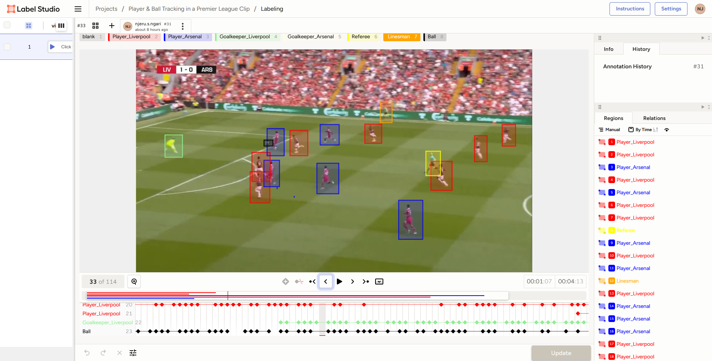

# Sports Video Annotation: Player Tracking & Event Detection

## Overview
This project involves annotating football match videos to track player movements using bounding boxes across video frames. Using **Label Studio**, each player (Liverpool, Arsenal, Referee) was manually tracked through sequences, creating a rich labeled dataset ideal for training object detection and tracking models in sports analytics.

The primary goal was to:
- Identify and annotate players from different teams.
- Track their positions frame by frame.
- Prepare structured data usable for AI model training (e.g., YOLO, DeepSORT, etc.).

## Dataset & Annotation
- **Tool Used**: Label Studio
- **Video Frames**: Manually annotated sequences over 114 frames.
- **Labels**: `Player_Liverpool`, `Player_Arsenal`, `Referee`.
- **Annotation Format**: JSON export from Label Studio.

Each annotation captures:
- Frame-specific bounding boxes.
- Movement sequences.
- Label identity (team/referee).

## Skills Demonstrated
✅ Hands-on experience with **video annotation pipelines**.  
✅ Understanding of **object detection labeling standards**.  
✅ Practical application of **Label Studio annotation workflows**.  
✅ Prepared data suitable for **computer vision model training**.

## Learning Outcomes
Through this project, I have learned:
- How to structure annotations for computer vision tasks.
- The importance of precise bounding boxes in model accuracy.
- Best practices for managing large-scale annotation tasks.
- How annotated data feeds into AI-driven sports analytics solutions.

## Screenshot
To visualize my work, here's a sample screenshot from my annotation session:

## Connect with Me
If you are interested in leveraging my skills for your AI or data annotation projects, feel free to reach out via LinkedIn:

👉 [Samuel N. Ngari on LinkedIn](https://www.linkedin.com/in/samuel-n-ngari)
